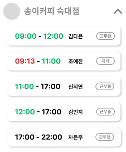

# Schedule API

### 📌 스케줄 상태 Enum

* `BEFORE_WORK` 스케줄 시작 전
* `ON_DUTY` 스케줄 진행 중 (정시 출근 후)
* `LATE` 스케줄 진행 중 (지각 출근 후)
* `SUCCESS` 스케줄 완료
* `FAIL` 스케줄 미완료 (ex. 지각, 조기 퇴근, 결근 등)

### 📌 전체 스케줄 상태 Enum

* `COMPLETE` 해당 날짜의 스케줄 모두 완료 (스케줄 상태가 모두 SUCCESS)
* `INCOMPLETE` 해당 날짜의 스케줄 중 완료되지 않은 건 1건 이상 존재
* `BEFORE` 해당 날짜의 스케줄 모두 시작 전 (현재 날짜 이후 날짜)
* `NONE` 해당 날짜의 스케줄 존재X

<mark style="color:green;"></mark>

<mark style="color:green;"></mark>

## <mark style="color:green;">GET</mark> /boss/schedules/home

> **홈 달력 정보 조회**

#### Request-Header

| Name                                             | Type     | Description    |
| ------------------------------------------------ | -------- | -------------- |
| <mark style="color:red;">\*</mark>`x-auth-token` | `String` | user jwt token |

#### Response-Body



| Name                   | Type      | Description                                  |
| ---------------------- | --------- | -------------------------------------------- |
| `dateList`             | `List`    | 오늘 날짜 기준 ±3일별 날짜와 전체 스케줄 상태 리스트              |
| `date`                 | `Object`  | 일별 날짜 정보                                     |
| `year`                 | `Integer` | 년도                                           |
| `month`                | `Integer` | 월                                            |
| `day`                  | `Integer` | 일                                            |
| `dayOfWeek`            | `String`  | 요일 이름                                        |
| `totalScheduleStatus`  | `String`  | 해당 날짜 전체 스케줄 상태                              |
| `selectedSubPage`      | `Object`  | 조회 날짜, 조회된 워크스페이스 리스트 정보 (날짜 선택 시마다 내용 업데이트) |
| `selectedDate`         | `Object`  | 오늘 날짜 정보 (선택된 날짜 정보)                         |
| `workspaceList`        | `List`    | 나의 워크스페이스 리스트                                |
| `workspaceId`          | `Long`    | 워크스페이스 id                                    |
| `name`                 | `String`  | 워크스페이스 이름                                    |
| `imageUrl`             | `String`  | 워크스페이스 이미지 url                               |
| `selectedScheduleList` | `List`    | 해당 워크스페이스의 해당 날짜 스케줄 리스트                     |
| `scheduleId`           | `Long`    | 스케줄 id                                       |
| `scheduleStartTime`    | `String`  | 예정된 스케줄 시작 시간                                |
| `scheduleEndTime`      | `String`  | 예정된 스케줄 종료 시간                                |
| `logicalStartTime`     | `String`  | 논리적 스케줄 시작 시간                                |
| `logicalEndTime`       | `String`  | 논리적 스케줄 종료 시간                                |
| `status`               | `String`  | 현재 스케줄 상태                                    |
| `worker`               | `Object`  | 스케줄 근무자 정보                                   |
| `workerId`             | `Long`    | 근무자 id                                       |
| `name`                 | `String`  | 근무자 이름                                       |
| `imageUrl`             | `String`  | 근무자 이미지 url                                  |



```json
{
    "dateList": [
        {
            "date": {
                "year": 2023,
                "month": 1,
                "day": 13,
                "dayOfWeek": "금"
            },
            "totalScheduleStatus": "INCOMPLETE"
        },
        {
            "date": {
                "year": 2023,
                "month": 1,
                "day": 14,
                "dayOfWeek": "토"
            },
            "totalScheduleStatus": "NONE"
        },
        {
            "date": {
                "year": 2023,
                "month": 1,
                "day": 15,
                "dayOfWeek": "일"
            },
            "totalScheduleStatus": "NONE"
        },
        {
            "date": {
                "year": 2023,
                "month": 1,
                "day": 16,
                "dayOfWeek": "월"
            },
            "totalScheduleStatus": "INCOMPLETE"
        },
        {
            "date": {
                "year": 2023,
                "month": 1,
                "day": 17,
                "dayOfWeek": "화"
            },
            "totalScheduleStatus": "NONE"
        },
        {
            "date": {
                "year": 2023,
                "month": 1,
                "day": 18,
                "dayOfWeek": "수"
            },
            "totalScheduleStatus": "NONE"
        },
        {
            "date": {
                "year": 2023,
                "month": 1,
                "day": 19,
                "dayOfWeek": "목"
            },
            "totalScheduleStatus": "NONE"
        }
    ],
    "selectedSubPage": {
        "selectedDate": {
            "year": 2023,
            "month": 1,
            "day": 16,
            "dayOfWeek": "월"
        },
        "workspaceList": [
            {
                "workspaceId": 4,
                "name": "송이떡볶이 숙대점",
                "imageUrl": "http://",
                "selectedScheduleList": []
            },
            {
                "workspaceId": 2,
                "name": "송이커피 숙대점",
                "imageUrl": "http://abcd",
                "selectedScheduleList": [
                    {
                        "scheduleId": 18,
                        "scheduleStartTime": "18:00",
                        "scheduleEndTime": "22:00",
                        "logicalStartTime": "18:00",
                        "logicalEndTime": "22:00",
                        "status": "SUCCESS",
                        "worker": {
                            "workerId": 2,
                            "name": "김나은",
                            "imageUrl": "http://abcd"
                        }
                    }
                ]
            },
            {
                "workspaceId": 3,
                "name": "송이토스트 숙대점",
                "imageUrl": "http://",
                "selectedScheduleList": []
            },
            {
                "workspaceId": 1,
                "name": "송이파스타 숙대점",
                "imageUrl": "http://",
                "selectedScheduleList": [
                    {
                        "scheduleId": 17,
                        "scheduleStartTime": "10:00",
                        "scheduleEndTime": "17:00",
                        "logicalStartTime": "11:00",
                        "logicalEndTime": "17:00",
                        "status": "FAIL",
                        "worker": {
                            "workerId": 2,
                            "name": "김나은",
                            "imageUrl": "http://abcd"
                        }
                    },
                    {
                        "scheduleId": 16,
                        "scheduleStartTime": "10:00",
                        "scheduleEndTime": "17:00",
                        "logicalStartTime": "11:00",
                        "logicalEndTime": "16:30",
                        "status": "FAIL",
                        "worker": {
                            "workerId": 1,
                            "name": "김다은",
                            "imageUrl": "http://"
                        }
                    }
                ]
            }
        ]
    }
}
```




****

## <mark style="color:green;">**GET**</mark>** ** /boss/schedules/home/selected

> **홈 해당 날짜 모든 가게의 스케줄 조회**

#### Request-Header

| Name                                             | Type     | Description    |
| ------------------------------------------------ | -------- | -------------- |
| <mark style="color:red;">\*</mark>`x-auth-token` | `String` | user jwt token |

#### Params

| Name                                      | Description |
| ----------------------------------------- | ----------- |
| <mark style="color:red;">\*</mark>`year`  | 조회 년도       |
| <mark style="color:red;">\*</mark>`month` | 조회 월        |
| <mark style="color:red;">\*</mark>`day`   | 조회 일        |

#### **Response-Body**



| Name                   | Type      | Description              |
| ---------------------- | --------- | ------------------------ |
| `selectedDate`         | `Object`  | 오늘 날짜 정보 (선택된 날짜 정보)     |
| `year`                 | `Integer` | 년도                       |
| `month`                | `Integer` | 월                        |
| `day`                  | `Integer` | 일                        |
| `dayOfWeek`            | `String`  | 요일 이름                    |
| `workspaceList`        | `List`    | 나의 워크스페이스 리스트            |
| `workspaceId`          | `Long`    | 워크스페이스 id                |
| `name`                 | `String`  | 워크스페이스 이름                |
| `imageUrl`             | `String`  | 워크스페이스 이미지 url           |
| `selectedScheduleList` | `List`    | 해당 워크스페이스의 해당 날짜 스케줄 리스트 |
| `scheduleId`           | `Long`    | 스케줄 id                   |
| `scheduleStartTime`    | `String`  | 예정된 스케줄 시작 시간            |
| `scheduleEndTime`      | `String`  | 예정된 스케줄 종료 시간            |
| `logicalStartTime`     | `String`  | 논리적 스케줄 시작 시간            |
| `logicalEndTime`       | `String`  | 논리적 스케줄 종료 시간            |
| `status`               | `String`  | 현재 스케줄 상태                |
| `worker`               | `Object`  | 스케줄 근무자 정보               |
| `workerId`             | `Long`    | 근무자 id                   |
| `name`                 | `String`  | 근무자 이름                   |
| `imageUrl`             | `String`  | 근무자 이미지 url              |

#### ✅ 논리적 스케줄 시작/종료 시간?

* 스케줄 출퇴근 시 현재 시간을 10분 단위로, 논리적으로 계산한 시간&#x20;
* ex. 10시가 출근 시간일 때, 10시 12분에 출근 시 10시 10분으로 출근 시간 저장&#x20;
* ex. 17시가 퇴근 시간일 때, 16시 37분에 퇴근 시 16시 30분으로 퇴근 시간 저장
* ex. 17시가 퇴근 시간일 때, 20시에 퇴근 시 17시로 퇴근 시간 저장&#x20;

✅ `logicalStartTime`이 null이면 `scheduleStartTime`, `logicalEndTime`이 null이면 `scheduleEndTime`을 표시


.png>)

* 전체 스케줄 상태가 `COMPLETE` → <mark style="color:green;">**초록색**</mark>
* `INCOMPLETE` → <mark style="color:red;">**빨간색**</mark>
* `BEFORE` → **회색**&#x20;
* `NONE` → 점 표시X




* `logicalStartTime`이 없으면 `scheduleStartTime` **검은색**
* `logicalStartTime`이 있으면서 `scheduleStartTime`과 같으면 `logicalStartTime` <mark style="color:green;">**초록색**</mark>
* `logicalStartTime`이 있으면서 `scheduleStartTime`과 다르면 `logicalStartTime` <mark style="color:red;">**빨간색**</mark>
* `logicalEndTime`이 없으면 `scheduleEndTime` **검은색**
* `logicalEndTime`이 있으면서 `scheduleEndTime`과 같으면 `logicalEndTime` <mark style="color:green;">**초록색**</mark>
* `logicalEndTime`이 있으면서 `scheduleEndTime`과 다르면 `logicalEndTime` <mark style="color:red;">**빨간색**</mark>



```json
{
    "selectedDate": {
        "year": 2023,
        "month": 1,
        "day": 16,
        "dayOfWeek": "월"
    },
    "workspaceList": [
        {
            "workspaceId": 4,
            "name": "송이떡볶이 숙대점",
            "imageUrl": "http://",
            "selectedScheduleList": []
        },
        {
            "workspaceId": 2,
            "name": "송이커피 숙대점",
            "imageUrl": "http://abcd",
            "selectedScheduleList": [
                {
                    "scheduleId": 18,
                    "scheduleStartTime": "18:00",
                    "scheduleEndTime": "22:00",
                    "logicalStartTime": "18:00",
                    "logicalEndTime": "22:00",
                    "status": "SUCCESS",
                    "worker": {
                        "workerId": 2,
                        "name": "김나은",
                        "imageUrl": "http://abcd"
                    }
                }
            ]
        },
        {
            "workspaceId": 3,
            "name": "송이토스트 숙대점",
            "imageUrl": "http://",
            "selectedScheduleList": []
        },
        {
            "workspaceId": 1,
            "name": "송이파스타 숙대점",
            "imageUrl": "http://",
            "selectedScheduleList": [
                {
                    "scheduleId": 17,
                    "scheduleStartTime": "10:00",
                    "scheduleEndTime": "17:00",
                    "logicalStartTime": "11:00",
                    "logicalEndTime": "17:00",
                    "status": "FAIL",
                    "worker": {
                        "workerId": 2,
                        "name": "김나은",
                        "imageUrl": "http://abcd"
                    }
                },
                {
                    "scheduleId": 16,
                    "scheduleStartTime": "10:00",
                    "scheduleEndTime": "17:00",
                    "logicalStartTime": "11:00",
                    "logicalEndTime": "16:30",
                    "status": "FAIL",
                    "worker": {
                        "workerId": 1,
                        "name": "김다은",
                        "imageUrl": "http://"
                    }
                }
            ]
        }
    ]
}
```

```json
//조회된 스케줄 없음
{
    "selectedDate": {
        "year": 2023,
        "month": 1,
        "day": 15,
        "dayOfWeek": "일"
    },
    "workspaceList": [
        {
            "workspaceId": 4,
            "name": "송이떡볶이 숙대점",
            "imageUrl": "http://",
            "selectedScheduleList": []
        },
        {
            "workspaceId": 2,
            "name": "송이커피 숙대점",
            "imageUrl": "http://abcd",
            "selectedScheduleList": []
        },
        {
            "workspaceId": 3,
            "name": "송이토스트 숙대점",
            "imageUrl": "http://",
            "selectedScheduleList": []
        },
        {
            "workspaceId": 1,
            "name": "송이파스타 숙대점",
            "imageUrl": "http://",
            "selectedScheduleList": []
        }
    ]
}
```



****

****

## <mark style="color:green;">**GET**</mark>** ** /boss/schedules

> **해당 워크스페이스 홈 달력 정보 조회**

#### Request-Header

| Name                                             | Type     | Description    |
| ------------------------------------------------ | -------- | -------------- |
| <mark style="color:red;">\*</mark>`x-auth-token` | `String` | user jwt token |

#### Params

| Name                                            | Description  |
| ----------------------------------------------- | ------------ |
| <mark style="color:red;">\*</mark>`workspaceId` | 조회 워크스페이스 id |

#### Response-Body



| Name                   | Type      | Description                              |
| ---------------------- | --------- | ---------------------------------------- |
| `selectedWorkspace`    | `Object`  | 조회 워크스페이스 정보                             |
| `workspaceId`          | `Long`    | 워크스페이스 id                                |
| `name`                 | `String`  | 워크스페이스 이름                                |
| `imageUrl`             | `String`  | 워크스페이스 이미지 url                           |
| `year`                 | `Integer` | 현재 년도                                    |
| `month`                | `Integer` | 현재 월                                     |
| `dateList`             | `List`    | 현재 년월의 일 리스트                             |
| `day`                  | `Integer` | 일                                        |
| `dayOfWeek`            | `String`  | 요일 이름                                    |
| `totalScheduleStatus`  | `String`  | 일별 전체 스케줄 상태                             |
| `selectedSubPage`      | `Object`  | 조회 일, 조회된 스케줄 리스트 정보 (날짜 선택 시마다 내용 업데이트) |
| `selectedDay`          | `Integer` | 조회 일                                     |
| `selectedScheduleList` | `List`    | 조회된 스케줄 리스트                              |
| `scheduleId`           | `Long`    | 스케줄 id                                   |
| `scheduleStartTime`    | `String`  | 예정된 스케줄 시작 시간                            |
| `scheduleEndTime`      | `String`  | 예정된 스케줄 종료 시간                            |
| `status`               | `String`  | 현재 스케줄 상태                                |
| `worker`               | `Object`  | 스케줄 근무자 정보                               |
| `workerId`             | `Long`    | 근무자 id                                   |
| `name`                 | `String`  | 근무자 이름                                   |



```json
{
    "selectedWorkspace": {
        "workspaceId": 2,
        "name": "송이커피 숙대점",
        "imageUrl": "http://"
    },
	
    "year": 2022,
    "month": 9,
    "dateList": [
        {
            "day": 1,
            "dayOfWeek": "THURSDAY",
            "totalScheduleStatus": "NONE"
	}, //이날에는 스케줄 존재X 
	{
	    "day": 2,
            "dayOfWeek": "FRIDAY",
	    "totalScheduleStatus": "COMPLETE"
	}, //전체 스케줄 모두 완료 
        //......
	{
	    "day": 29,
            "dayOfWeek": "THURSDAY",
	    "totalScheduleStatus": "INCOMPLETE"
	}, //전체 스케줄 중 정상적으로 완료되지 못한 건 하나 이상 존재 
	{
	    "day": 30,
            "dayOfWeek": "FRIDAY",
	    "totalScheduleStatus": "BEFORE"
	} //전체 스케줄 시작 전 (현재 날짜 이후 날짜)
    ],

    "selectedSubPage": {
        "selectedDay": 30,
        "selectedScheduleList": [
            {
                "scheduleId": 10,
                "scheduleStartTime": "15:00",
                "scheduleEndTime": "19:00",
                "status": "SUCCESS",
                "worker": {
                    "workerId": 3, 
                    "name": "신지연"   
                }
            },
            {
                "scheduleId": 9,
                "scheduleStartTime": "17:00",
                "scheduleEndTime": "19:00",
                "status": "BEFORE_WORK",
                "worker": {
                    "workerId": 5, 
                    "name": "김다은"
                }
            },
            {
                "scheduleId": 8,
                "scheduleStartTime": "21:00",
                "scheduleEndTime": "03:00",
                "status": "BEFORE_WORK",
                "worker": {
                    "workerId": 4, 
                    "name": "조예진"
                }
            }
        ]
    }
}
```




## <mark style="color:green;">GET</mark> /boss/schedules/selected

> **해당 워크스페이스 홈 해당 날짜 스케줄 조회**

#### Request-Header

| Name                                             | Type     | Description    |
| ------------------------------------------------ | -------- | -------------- |
| <mark style="color:red;">\*</mark>`x-auth-token` | `String` | user jwt token |

#### Params

| Name                                            | Description  |
| ----------------------------------------------- | ------------ |
| <mark style="color:red;">\*</mark>`workspaceId` | 조회 워크스페이스 id |
| <mark style="color:red;">\*</mark>`year`        | 조회 년도        |
| <mark style="color:red;">\*</mark>`month`       | 조회 월         |
| <mark style="color:red;">\*</mark>`day`         | 조회 일         |

#### Response-Body



| Name                   | Type      | Description   |
| ---------------------- | --------- | ------------- |
| `selectedDay`          | `Integer` | 조회 일          |
| `selectedScheduleList` | `List`    | 조회된 스케줄 리스트   |
| `scheduleId`           | `Long`    | 스케줄 id        |
| `scheduleStartTime`    | `String`  | 예정된 스케줄 시작 시간 |
| `scheduleEndTime`      | `String`  | 예정된 스케줄 종료 시간 |
| `status`               | `String`  | 현재 스케줄 상태     |
| `worker`               | `Object`  | 스케줄 근무자 정보    |
| `workerId`             | `Long`    | 근무자 id        |
| `name`                 | `String`  | 근무자 이름        |



```json
{
    "selectedDay": 30,
    "selectedScheduleList": [
        {
            "scheduleId": 10,
            "scheduleStartTime": "15:00",
            "scheduleEndTime": "19:00",
            "status": "SUCCESS",
            "worker": {
                "workerId": 3, 
                "name": "신지연"   
            }
        },
        {
            "scheduleId": 9,
            "scheduleStartTime": "17:00",
            "scheduleEndTime": "19:00",
            "status": "BEFORE_WORK",
            "worker": {
                "workerId": 5, 
                "name": "김다은"
            }
        },
        {
            "scheduleId": 8,
            "scheduleStartTime": "21:00",
            "scheduleEndTime": "03:00",
            "status": "BEFORE_WORK",
            "worker": {
                "workerId": 4, 
                "name": "조예진"
            }
        }
    ]
}
```




## <mark style="color:green;">GET</mark> /boss/schedules/possible/staffs&#x20;

> **해당 날짜에 근무 가능한 해당 워크스페이스 내 알바 리스트 조회 (for 스케줄 추가)**

#### Request-Header

| Name                                             | Type     | Description    |
| ------------------------------------------------ | -------- | -------------- |
| <mark style="color:red;">\*</mark>`x-auth-token` | `String` | user jwt token |

#### Params

| Name                                            | Description  |
| ----------------------------------------------- | ------------ |
| <mark style="color:red;">\*</mark>`workspaceId` | 해당 워크스페이스 id |
| <mark style="color:red;">\*</mark>`start`       | 스케줄 시작 시간    |
| <mark style="color:red;">\*</mark>`end`         | 스케줄 종료 시간    |

#### Response-Body



| Name        | Type     | Description   |
| ----------- | -------- | ------------- |
| `staffList` | `List`   | 근무 가능한 알바 리스트 |
| `staffId`   | `Long`   | 알바 id         |
| `name`      | `String` | 알바 이름         |
| `imageUrl`  | `String` | 알바 이미지 url    |



```json
{
    "staffList": [
        {
	    "staffId": 5,
	    "name": "김다은",
            "imageUrl": "http://"
	},
	{
	    "staffId": 4,
	    "name": "신지연",
            "imageUrl": "http://"
	},
	{
	    "staffId": 3,
	    "name": "조예진",
            "imageUrl": "http://"
	}
    ]
}
```




## <mark style="color:yellow;">POST</mark> /boss/schedules&#x20;

> **스케줄 생성**

#### Request-Header

| Name                                             | Type     | Description    |
| ------------------------------------------------ | -------- | -------------- |
| <mark style="color:red;">\*</mark>`x-auth-token` | `String` | user jwt token |

#### Request-Body



| Name                                                 | Type      | Description       |
| ---------------------------------------------------- | --------- | ----------------- |
| <mark style="color:red;">\*</mark>`workspaceId`      | `Long`    | 스케줄 진행할 워크스페이스 id |
| <mark style="color:red;">\*</mark>`staffId`          | `Long`    | 스케줄 근무할 알바 id     |
| <mark style="color:red;">\*</mark>`scheduleDateTime` | `Object`  | 스케줄 날짜 시간 정보      |
| <mark style="color:red;">\*</mark>`start`            | `String`  | 스케줄 시작 날짜 시간      |
| <mark style="color:red;">\*</mark>`end`              | `String`  | 스케줄 종료 날짜 시간      |
| <mark style="color:red;">\*</mark>`hourlyWage`       | `Integer` | 스케줄 시급            |



```json
{
    "workspaceId": 1,
    "staffId": 1,
    "scheduleDateTime": {
        "start": "2023-01-06 10:00",
        "end": "2023-01-06 17:00"
    },
    "hourlyWage": 9160
}
```




## <mark style="color:red;">DELETE</mark> /boss/schedules/{scheduleId}

> **해당 스케줄 삭제**

#### Request-Header

| Name                                             | Type     | Description    |
| ------------------------------------------------ | -------- | -------------- |
| <mark style="color:red;">\*</mark>`x-auth-token` | `String` | user jwt token |

****

****

## <mark style="color:green;">GET</mark> /boss/schedules/reports/dates

> **근무내역 및 알바비 관리 년월 리스트 조회**

#### Request-Header

| Name                                             | Type     | Description    |
| ------------------------------------------------ | -------- | -------------- |
| <mark style="color:red;">\*</mark>`x-auth-token` | `String` | user jwt token |

#### **Params**

| Name                                            | Description  |
| ----------------------------------------------- | ------------ |
| <mark style="color:red;">\*</mark>`workspaceId` | 조회 워크스페이스 id |

#### **Response-Body**



| Name       | Type      | Description                 |
| ---------- | --------- | --------------------------- |
| `dateList` | `List`    | 근무내역 및 알바비 관리 조회 가능한 날짜 리스트 |
| `year`     | `Integer` | 조회 가능 년도                    |
| `month`    | `Integer` | 조회 가능 월                     |



```json
{
    "dateList": [
        {
            "year": 2022,
            "month": 11
        },
        {
            "year": 2022,
            "month": 12
        },
        {
            "year": 2023,
            "month": 1
        }
    ]
}
```



****

****

## <mark style="color:green;">GET</mark> /boss/schedules/reports

> **해당 가게, 해당 년월 근무내역 및 알바비 관리 리스트 조회**

#### Request-Header

| Name                                             | Type     | Description    |
| ------------------------------------------------ | -------- | -------------- |
| <mark style="color:red;">\*</mark>`x-auth-token` | `String` | user jwt token |

#### Params

| Name                                            | Description  |
| ----------------------------------------------- | ------------ |
| <mark style="color:red;">\*</mark>`workspaceId` | 조회 워크스페이스 id |
| <mark style="color:red;">\*</mark>`year`        | 조회 년도        |
| <mark style="color:red;">\*</mark>`month`       | 조회 월         |

#### Response-Body



| Name                  | Type      | Description       |
| --------------------- | --------- | ----------------- |
| `selectedWorkspaceId` | `Long`    | 조회 워크스페이스 id      |
| `selectedYear`        | `Integer` | 조회 년도             |
| `selectedMonth`       | `Integer` | 조회 월              |
| `workReportList`      | `List`    | 근무내역 및 알바비 관리 리스트 |
| `worker`              | `Object`  | 근무자 정보            |
| `workerId`            | `Long`    | 근무자 id            |
| `name`                | `String`  | 근무자 이름            |
| `imageUrl`            | `String`  | 근무자 이미지 url       |
| `totalWorkTimeHour`   | `Integer` | 해당 월 전체 근무 시간     |
| `totalWorkTimeMin`    | `Integer` | 해당 월 전체 근무 분      |
| `totalWorkPay`        | `String`  | 해당 월 전체 알바비       |



```json
{
    "selectedWorkspaceId": 2,
    "selectedYear": 2022,
    "selectedMonth": 9,
    "workReportList": [
        {
            "worker": {
                "workerId": 4,
                "name": "조예진",
                "imageUrl": "http://"
            },
            "totalWorkTimeHour": 40,
	    "totalWorkTimeMin": 0,
	    "totalWorkPay": "320,600"
	},
	{
	    "worker": {
                "workerId": 3,
                "name": "신지연",
                "imageUrl": "http://"
            },
	    "totalWorkTimeHour": 35,
	    "totalWorkTimeMin": 30,
	    "totalWorkPay": "320,600"
	},
	{
	    "worker": {
                "workerId": 5,
                "name": "김다은",
                "imageUrl": "http://"
            },
	    "totalWorkTimeHour": 35,
	    "totalWorkTimeMin": 30,
	    "totalWorkPay": "320,600"
	},
	{
	    "worker": {
                "workerId": 1,
                "name": "차은우",
                "imageUrl": "http://"
            },
	    "totalWorkTimeHour": 35,
	    "totalWorkTimeMin": 30,
	    "totalWorkPay": "320,600"
	},
	{
	    "worker": {
                "workerId": 2,
                "name": "김민지",
                "imageUrl": "http://"
            },
	    "totalWorkTimeHour": 35,
	    "totalWorkTimeMin": 30,
	    "totalWorkPay": "320,600"
	}
    ]
}
```



